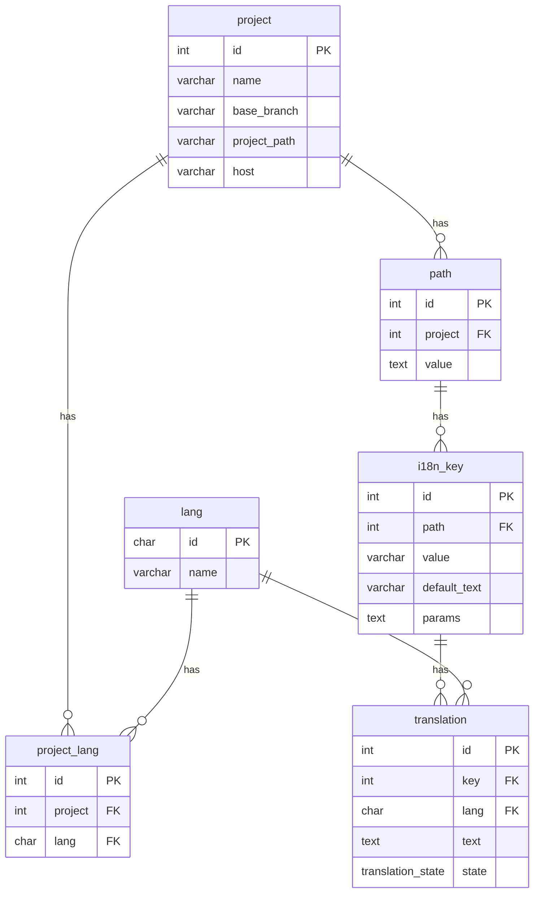

# SQL Tables

```mermaid
erDiagram
    project {
        int id PK
        varchar name
        varchar base_branch
        varchar project_path
        varchar host
    }
    lang {
        char id PK
        varchar name
    }
    project_lang {
        int id PK
        int project FK
        char lang FK
    }
    path {
        int id PK
        int project FK
        text value
    }
    i18n_key {
        int id PK
        int path FK
        varchar value
        varchar default_text
        text params
    }
    translation {
        int id PK
        int key FK
        char lang FK
        text text
        translation_state state
    }

    project ||--o{ project_lang : "has"
    lang ||--o{ project_lang : "has"
    project ||--o{ path : "has"
    path ||--o{ i18n_key : "has"
    i18n_key ||--o{ translation : "has"
    lang ||--o{ translation : "has"
```
